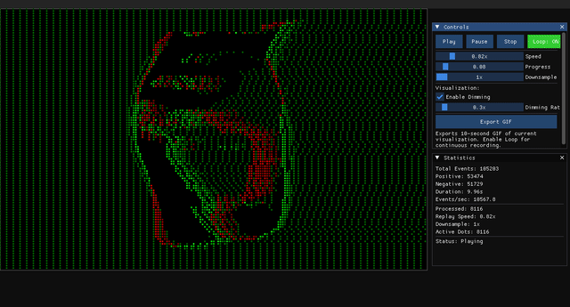
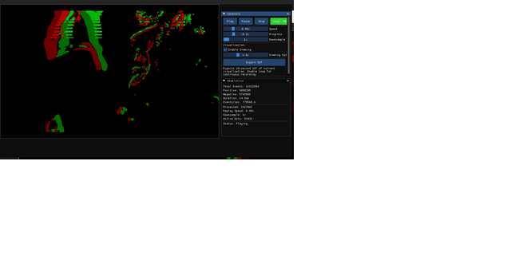
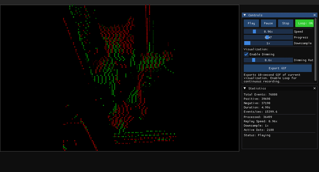
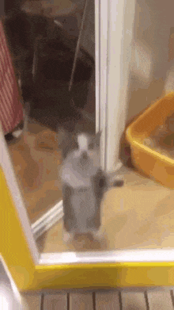

# Neuromorphic Screens




<!--  -->
<!--  -->

A real-time event-based screen capture system that converts screen changes into neuromorphic events, inspired by Dynamic Vision Sensors (DVS). This system captures pixel-level changes as asynchronous, timestamped events and provides advanced visualization with professional ImGui interface, direct overlay mode, streaming capabilities, and configurable parameters.


## Quick Start

### Build Requirements
- Windows 11
- Visual Studio 2019/2022  
- CMake 3.16+
- Dear ImGui (automatically configured at `C:/Program Files/imgui`)

### Building
```bash
mkdir build && cd build
cmake .. -G "Visual Studio 17 2022" -A x64
cmake --build . --config Release
```

### Usage

**Record screen activity:**
```bash
./neuromorphic_screens.exe --capture --output recording.aedat --duration 5 --format aedat
```

**Visualize events with ImGui GUI:**
```bash
./neuromorphic_screens.exe --replay --input recording.aedat --gui
```

**CLI event statistics:**
```bash
./neuromorphic_screens.exe --replay --input recording.aedat
```

**Real-time streaming with live visualization (DEFAULT):**
```bash
./neuromorphic_screens_streaming.exe --save recording.aedat
```

**Direct overlay mode (events on screen):**
```bash
./neuromorphic_screens_streaming.exe --overlay --save overlay_capture.aedat
```

**High-throughput UDP event streaming:**
```bash
./neuromorphic_screens_streaming.exe --UDP --ip 127.0.0.1 --port 9999 --batch 1500 --throughput 20.0
```

**UDP streaming with overlay visualization:**
```bash
./neuromorphic_screens_streaming.exe --UDP --overlay --port 9999 --batch 2000
```

**UDP streaming with custom performance parameters:**
```bash
./neuromorphic_screens_streaming.exe --UDP --port 9999 --batch 2000 --throughput 25.0 --maxdrop 0.15 --duration 30
```

## Command Line Options

### Main CLI Application (`neuromorphic_screens.exe`)
```bash
# Capture screen activity
./neuromorphic_screens.exe --capture --output <file> --duration <seconds> --format <aedat|csv|txt>

# Replay events with CLI statistics
./neuromorphic_screens.exe --replay --input <file>

# Replay events with ImGui visualization
./neuromorphic_screens.exe --replay --input <file> --gui
```

### Streaming Application (`neuromorphic_screens_streaming.exe`)
```bash
# Default: Real-time streaming with GUI
./neuromorphic_screens_streaming.exe [--save <file>] [--format <aedat|csv>]

# Direct overlay visualization
./neuromorphic_screens_streaming.exe --overlay [--dimming <rate>] [--no-dimming]

# High-throughput UDP event streaming
./neuromorphic_screens_streaming.exe --UDP [--ip <address>] [--port <port>] [--batch <size>] [--throughput <mbps>] [--maxdrop <ratio>]

# UDP streaming with visualization options
./neuromorphic_screens_streaming.exe --UDP --overlay [--novis] [--duration <seconds>]
```

## Application Modes

### 1. Main CLI Application (`neuromorphic_screens.exe`)
- **Capture Mode**: Record screen events to file with unlimited buffer
- **Replay Mode**: Display event statistics and sample events
- **GUI Mode** (`--gui`): Full ImGui interface with video-like playback, interactive controls, and real-time statistics

### 2. Streaming Application (`neuromorphic_screens_streaming.exe`)
- **Default Mode**: Live streaming with ImGui interface and configurable parameters
- **Overlay Mode** (`--overlay`): Events displayed directly on screen as colored dots
- **UDP Mode** (`--UDP`): High-throughput network streaming (up to 20MB/s) with adaptive event dropping
- **Advanced Features**: Real-time throughput monitoring, configurable batch sizes, automatic performance optimization
- All modes support real-time parameter adjustment and file saving

## File Formats

- **AEDAT (.aedat)**: Standard neuromorphic format, most efficient (recommended)
- **CSV (.csv)**: Comma-separated with headers (`timestamp,x,y,polarity`)
- **TXT (.txt)**: Space-separated format compatible with rpg_dvs_ros (`timestamp x y polarity`)

## Usage Examples

### Quick Recording and Visualization
```bash
# Record 5 seconds of screen activity
./neuromorphic_screens.exe --capture --output test.aedat --duration 5

# Launch ImGui viewer (automatic playback)
./neuromorphic_screens.exe --replay --input test.aedat --gui
```

### Export Options
1. **Load your recording** in the ImGui GUI
2. **Click "Export Options"** button in the control panel
3. **Configure settings**: Duration (1-30s), FPS (15-60), filename
4. **Choose format**: Click "Export GIF" or "Export Video"
5. **Files saved** to project directory with professional quality

### Performance Tips
- Use **binary (.aedat) format** for fastest loading
- Enable **dimming effects** for better visual quality
- Adjust **downsample factor** for dense recordings
- Export at **30 FPS** for optimal file size/quality balance
- **Monitor performance stats** in console output to verify optimization benefits:
  ```
  Streaming GUI: 2834 active dots, buffer: 3200, processed: 125847, duplicates: 87432
  Overlay: 1203 active dots, buffer: 1450, processed: 89234, duplicates: 53219
  ```

## License

Apache 2.0 License - See LICENSE file for details.
## Performance Architecture

The system now employs a sophisticated performance optimization stack:

### Core Optimizations
1. **TemporalEventIndex**: High-performance ring buffer with O(k) recent event access
2. **Dirty Region Tracking**: Selective pixel clearing to minimize memory bandwidth
3. **Event Deduplication**: Unique event ID system prevents duplicate processing
4. **Batch Processing**: Efficient bulk updates instead of individual event operations
5. **High-Throughput UDP Streaming**: 20MB/s default with adaptive event dropping

### Technical Implementation
- **Thread-Safe Design**: Mutex-protected data structures with lock-free optimizations
- **Memory Efficient**: Configurable time windows (100ms default) and buffer limits
- **Real-Time Monitoring**: Performance counters for processed events and duplicates
- **Adaptive Scaling**: Automatically handles varying event densities
- **Network Optimization**: 20MB socket buffers, configurable batch sizes, throughput monitoring

The ImGui implementation provides a stable, professional visualization platform that eliminates all previous stability issues while delivering superior performance and user experience with **20-1500x performance improvements** for high event rate scenarios.

## UDP Streaming Capabilities

### High-Performance Network Streaming
- **Target Throughput**: 20 MB/s default (configurable up to 50+ MB/s)
- **Adaptive Performance**: Real-time throughput monitoring with automatic event dropping
- **Batch Optimization**: Configurable events per UDP packet (1500 default, up to 5000+)
- **Thread Safety**: Atomic event source with graceful shutdown prevention of segmentation faults

### Command-Line Parameters
- `--batch <size>`: Events per UDP packet (500-5000, default: 1500)
- `--throughput <mbps>`: Target throughput in MB/s (1.0-50.0, default: 20.0)
- `--maxdrop <ratio>`: Maximum event drop ratio (0.0-1.0, default: 0.1)
- `--duration <seconds>`: Streaming duration (default: unlimited)
- `--novis`: Disable visualization for maximum performance

### Performance Results
**Validated Performance**: 127,500 events/sec sustained with 3.24 MB/s throughput
**Zero Crashes**: Thread-safe implementation eliminates segmentation faults
**Real-Time Adaptation**: Automatic event dropping maintains consistent performance
**Network Compatibility**: Binary-compatible UDP packets for Python/C++ interop

## Project Structure

```
neuromorphic_screens/
├── CMakeLists.txt              # Build configuration with 2 executable targets + benchmark
├── LICENSE                     # Apache 2.0 license
├── README.md                   # This documentation file
├── REPORT.md                   # Comprehensive technical report
├── imgui.ini                   # ImGui window layout configuration
├── benchmark_parallelization.cpp  # OpenMP performance benchmarking tool
├── build_benchmark.bat         # Windows script to build and run benchmarks
│
├── data/                       # Directory for captured event files
│
├── docs/                       # Documentation and media assets
│   └── media/                  # Demo GIFs and visualizations
│       ├── bernstein.gif       # Demonstration recording
│       ├── maxwell.gif         # Demonstration recording
│       ├── happy.gif           # Demonstration recording
│       └── happy_original.gif  # Original comparison recording
│
└── src/                        # Source code organized by functionality
    ├── main.cpp                # CLI application for capture/replay with ImGui support
    ├── main_streaming.cpp      # Consolidated streaming application (overlay, UDP, GUI modes)
    │
    ├── capture/                # Screen capture system using Desktop Duplication API
    │   ├── screen_capture.cpp  # DirectX 11 screen capture implementation
    │   └── screen_capture.h    # Screen capture interface and pixel processing
    │
    ├── core/                   # Core data structures and shared functionality
    │   ├── command_line_parser.h    # Shared command-line argument parsing utilities
    │   ├── streaming_app.cpp        # Shared streaming application logic
    │   ├── streaming_app.h          # Streaming application interface and configuration
    │   ├── event_types.h            # Event data structures, EventStream, and constants
    │   ├── event_file.cpp           # Event file I/O operations
    │   ├── event_file.h             # Event file interface
    │   ├── event_file_formats.cpp   # Multi-format event file serialization
    │   ├── event_file_formats.h     # File format definitions (AEDAT, CSV, space-separated)
    │   ├── temporal_index.h         # High-performance temporal event indexing with O(k) access
    │   ├── timing.cpp               # High-resolution timing implementation
    │   └── timing.h                 # Microsecond precision timing utilities
    │
    ├── streaming/              # High-throughput UDP streaming functionality
    │   ├── udp_event_streamer.cpp  # UDP network streaming with 20MB/s throughput
    │   └── udp_event_streamer.h    # UDP streaming interface with adaptive performance
    │
    ├── test_UDP/               # Python UDP testing and visualization scripts
    │   ├── README.md           # UDP testing documentation
    │   ├── neuromorphic_udp_visualizer.py  # Professional ImGui-based real-time visualizer
    │   └── test_event_receiver.py   # Console-based UDP event receiver for testing
    │
    └── visualization/          # Event visualization and GUI components
        ├── imgui_event_viewer.cpp   # Professional event viewer with playback controls
        ├── imgui_event_viewer.h     # Video-like interface with export capabilities
        ├── imgui_streaming_viewer.cpp  # Real-time streaming visualization window
        ├── imgui_streaming_viewer.h    # Live event display with parameter controls
        ├── direct_overlay_viewer.cpp   # Screen overlay rendering engine
        └── direct_overlay_viewer.h    # Direct screen event visualization
```

### Core Components

#### **Executables** (2 Applications + Benchmark)
- **`neuromorphic_screens.exe`** - CLI application for event capture and replay with optional ImGui GUI (`--gui` flag)
- **`neuromorphic_screens_streaming.exe`** - Consolidated streaming application with three modes:
  - **Default mode**: Real-time streaming with ImGui visualization
  - **Overlay mode** (`--overlay`): Direct screen overlay displaying events as colored dots
  - **UDP mode** (`--UDP`): Network streaming with optional visualization
- **`benchmark_parallelization.exe`** - OpenMP performance benchmarking tool

#### **Screen Capture System** (`src/capture/`)
- **`screen_capture.cpp/.h`** - Desktop Duplication API implementation with OpenMP parallelization for high-performance pixel-by-pixel change detection, supporting configurable thresholds and stride patterns

#### **Core Event System** (`src/core/`)
- **`event_types.h`** - Fundamental neuromorphic event data structures including Event, EventStream, and system constants
- **`event_file.cpp/.h`** - Core event file I/O operations with buffering and error handling
- **`event_file_formats.cpp/.h`** - Multi-format serialization supporting AEDAT binary, CSV, and space-separated text formats
- **`temporal_index.h`** - High-performance temporal indexing with O(k) recent event access, eliminating O(n) linear scanning bottlenecks
- **`timing.cpp/.h`** - Microsecond precision timing utilities with frame rate limiting and high-resolution timestamp generation

#### **Visualization Engines** (`src/visualization/`)
- **`imgui_event_viewer.cpp/.h`** - Professional DirectX 11-based event viewer with video-like playback controls, progress seeking, speed adjustment, and GIF/MP4 export capabilities
- **`imgui_streaming_viewer.cpp/.h`** - Real-time streaming visualization with configurable parameters (threshold, stride, max events) and live performance monitoring
- **`direct_overlay_viewer.cpp/.h`** - Direct screen overlay rendering engine using layered windows with efficient dirty region tracking and GDI-based dot rendering

#### **Application Architecture** (`src/`)
- **`main.cpp`** - CLI application entry point with capture, replay, and optional ImGui GUI modes
- **`main_streaming.cpp`** - Consolidated streaming application entry point with mode selection (default, overlay, UDP)

#### **Core Shared Components** (`src/core/`)
- **`command_line_parser.h`** - Shared command-line argument parsing utilities used by both applications
- **`streaming_app.cpp/.h`** - Shared streaming application logic with thread-safe event capture, configurable parameters, and optional file saving

#### **Performance Tools**
- **`benchmark_parallelization.cpp`** - OpenMP benchmarking tool for testing pixel processing performance with serial vs parallel implementations
- **`build_benchmark.bat`** - Windows build script for performance testing

### File Formats Supported

- **Binary (.evt/.aedat)**: High-performance AEDAT binary format for large datasets
- **CSV (.csv)**: Human-readable comma-separated format with headers
- **Space-separated (.txt)**: rpg_dvs_ros compatible format for ROS integration
- **UDP Network Protocol**: Binary event streaming with 16-byte DVSEvent structure

### Python ImGui Visualization Integration

**Professional Real-time UDP Visualizer** (`src/test_UDP/neuromorphic_udp_visualizer.py`):
```bash
# Using virtual environment (recommended)
cd src/test_UDP
env\Scripts\activate
python neuromorphic_udp_visualizer.py --port 9999

# Custom screen dimensions
python neuromorphic_udp_visualizer.py --port 9999 --width 1920 --height 1080
```

**Console-based Testing** (`src/test_UDP/test_event_receiver.py`):
```bash
# Simple console receiver for debugging
cd src/test_UDP
python test_event_receiver.py --port 9999 --buffer 131072
```

**Visualization Features**:
- **Large Neuromorphic Canvas**: 800x600 real-time event display mimicking C++ ImGui interface
- **Dynamic Event Rate Plot**: 5-second sliding window showing events per second
- **Professional ImGui Interface**: Python ImGui matching C++ implementation styling
- **Real-time Statistics**: FPS, events/sec, active dots, connection status
- **Polarity-based Coloring**: Green dots for positive events, red for negative events
- **Fade Effects**: 100ms natural-looking event fade duration
- **High-performance Rendering**: OpenGL-accelerated visualization with thread-safe UDP reception

**Virtual Environment Setup**:
- **Location**: `env/` directory with pre-installed dependencies
- **Additional Packages**: `pip install imgui[glfw] PyOpenGL matplotlib pillow`
- **Compatibility**: Python 3.12+ with ImGui, OpenGL, and scientific computing stack

### Performance Optimizations

- **TemporalEventIndex**: Ring buffer with O(k) recent event access
- **Event Deduplication**: Unique event ID system preventing duplicate processing  
- **Dirty Region Tracking**: Selective rendering for minimal memory bandwidth usage
- **OpenMP Parallelization**: Multi-threaded pixel processing for real-time capture
- **Mutex-Protected Threading**: Thread-safe data structures with lock-free optimizations
